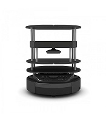
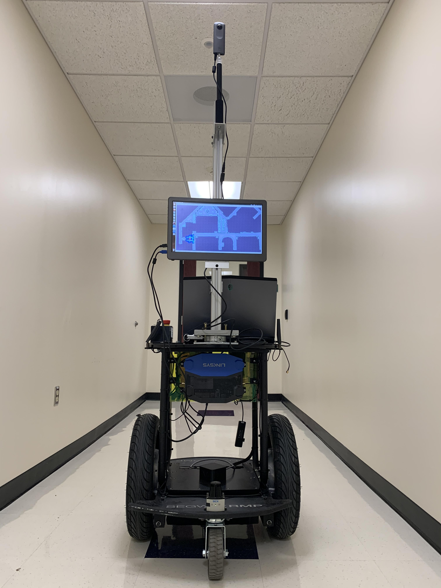

# Instructions for AIR Lab Members for running different robotic platforms.
> AIR Lab has several robotic platforms and this page will guide you how to operate them. 

## Robotic Platforms
* [Turtlebot](#turtlebot)
* [Segbot](#segbot)
* [UR5e Robotic Arm](#ur5e)

## Turtlebot
AIR Lab has a team of 8 Turtlebot-2 robots. 

## Segbot
The lab also have a Segway-based mobile robot platform (RMP-110).

## UR5e Robotic Arm
The lab also has a collaborative robot arm from Universal Robots with a two-finger gripper and 6-DOF.

